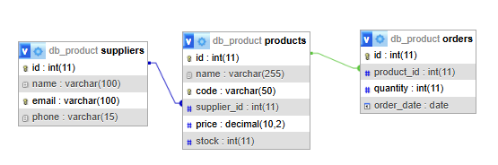

# TP7DPBO2425C1
TP 7 DPBO OOP dalam Website PHP dengan GUI membuat web Sistem Manajemen Produk

# Janji
Saya Muhammad Rangga Nur Praditha dengan Nim 2400297 mengerjakan Tugas Praktikum 7 dalam mata kuliah Desain Pemrograman Berorientasi Objek untuk keberkahan-Nya maka saya tidak akan melakukan kecurangan seperti yang telah di spesifikasikan. Aamiin

## 🛒 Sistem Manajemen Produk
### 📖 Tema Website
Website ini merupakan sistem manajemen produk dan supplier sederhana yang digunakan untuk mengelola data barang, pemasok, dan pesanan. Melalui sistem ini, pengguna dapat:
1. Menambahkan, mengedit, dan menghapus produk.
2. Mengelola data supplier yang menyediakan produk.
3. Membuat dan membatalkan pesanan produk.

Aplikasi ini dibuat menggunakan PHP berbasis OOP dengan Prepared Statement (PDO) untuk keamanan dan efisiensi akses data.

### 🗃️ Struktur Database
Nama database **`db_product`** dengan 3 tabel utama:
1. 📦 **`suppliers`**
Berfungsi menyimpan informasi pemasok produk.
- id → INT (PK, AUTO_INCREMENT) — ID unik setiap supplier
- name → VARCHAR(100) — Nama supplier
- email → VARCHAR(100) — Email kontak supplier
- phone → VARCHAR(20) — Nomor telepon supplier

2. 🧾 **`products`**
Menyimpan daftar produk yang dijual, termasuk harga, stok, dan supplier.
- id → INT (PK, AUTO_INCREMENT) — ID unik setiap produk
- name → VARCHAR(100) — Nama produk
- code → VARCHAR(50) — Kode unik produk
- supplier_id → INT (FK) — Relasi ke suppliers.id
- price → DECIMAL(10,2) — Harga produk
- stock → INT — Jumlah stok tersedia

Relasi: 
`products.supplier_id` → foreign key ke `suppliers.id` 
➡️ Satu supplier dapat menyediakan banyak produk **(One-to-Many)**

3. 🛍️ **`orders`**
Menyimpan data pesanan yang dibuat berdasarkan produk yang dibeli.
- id → INT (PK, AUTO_INCREMENT) — ID unik pesanan
- product_id → INT (FK) — Relasi ke products.id
- quantity → INT — Jumlah produk yang dipesan
- order_date → DATE — Tanggal pesanan dibuat

Relasi: 
`orders.product_id` → foreign key ke `products.id` 
➡️ Satu produk bisa muncul di banyak pesanan **(One-to-Many)**

### 🧩 Diagram Relasi
Suppliers (1) → Products (∞) 
Products (1) → Orders (∞)

  

### ⚙️ Struktur File & Fungsinya
1. 📁 index.php
File utama yang mengatur alur navigasi dan aksi CRUD.
- Menghubungkan ke database (`config/db.php`).
- Memuat class (`Product`, `Supplier`, `Order`).
- Menangani aksi seperti:
  - Tambah, ubah, hapus produk dan supplier.
  - Buat dan batalkan pesanan.
  - Menentukan halaman tampilan melalui parameter URL.

2. 📁 class/
Berisi class OOP untuk setiap entitas:
- Product.php → Fitur CRUD produk.
- Supplier.php → Fitur CRUD supplier.
- Order.php → Fitur CRUD dan batalkan pesanan.

Semua query menggunakan **Prepared Statement (PDO)** untuk keamanan SQL Injection.

3. 📁 view/
Berisi tampilan HTML untuk setiap halaman:
- products.php → Daftar produk & form tambah produk.
- productEdit.php → Form edit produk.
- suppliers.php → Daftar supplier & form tambah supplier.
- supplierEdit.php → Form edit supplier.
- orders.php → Daftar pesanan & form tambah pesanan baru.
- orderEdit.php → Form edit pesanan.
- header.php dan footer.php → Elemen tampilan umum.

### 🧭 Alur Umum Program
Saat website dijalankan, `index.php` menjadi pusat logika utama. 
File ini menghubungkan ke database, memuat class, dan menentukan halaman yang akan ditampilkan. 
Setiap aksi pengguna — seperti menambah, mengedit, menghapus, atau memesan — dikirim ke class terkait di folder `class/` untuk diproses menggunakan Prepared Statement, kemudian hasilnya ditampilkan melalui file di `view/`. 
Secara singkat, alur program berjalan sebagai berikut: 
**index.php → class/ (proses logika) → view/ (tampilan hasil)**

## 📸 Dokumentasi
https://github.com/user-attachments/assets/868ff127-5998-48cb-ab22-8e3a4d398b49
